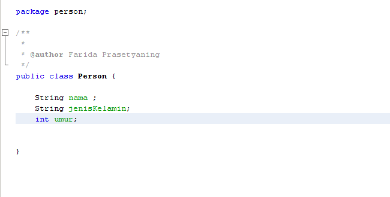
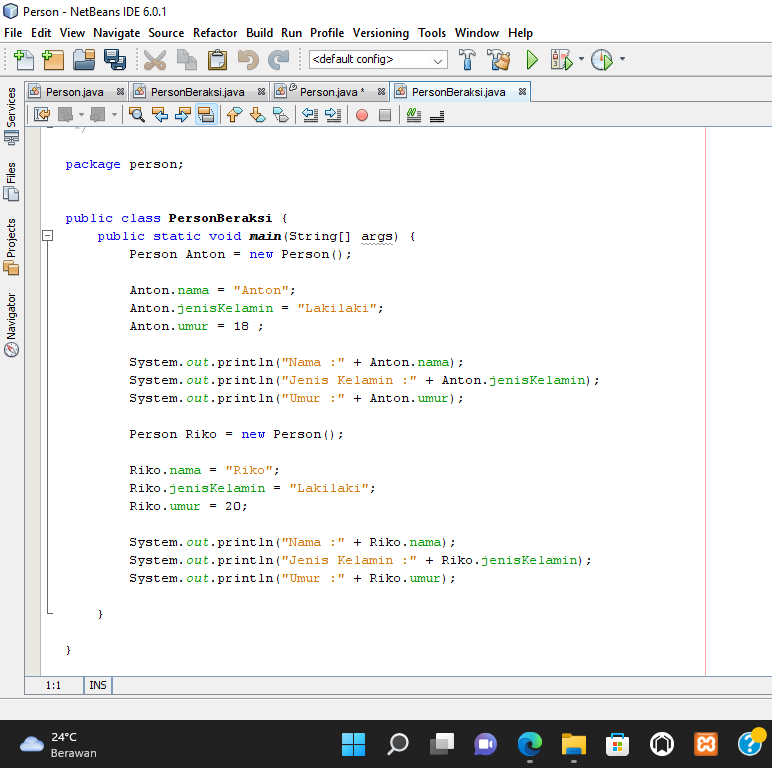
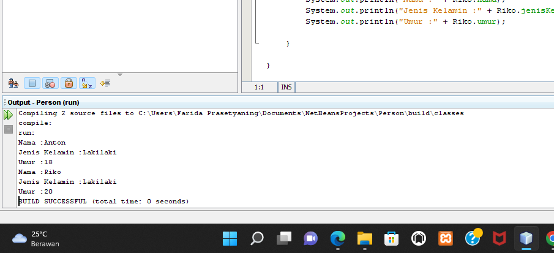

# PemWeb1
 ## Tugas Pemograman Berbasis Objek Membuat sebuah class person dan dua objek

tag untuk sebuah class yaitu public clas namaclass

pembuatan objek dan pemanggilan atribut

untuk outputnya 

